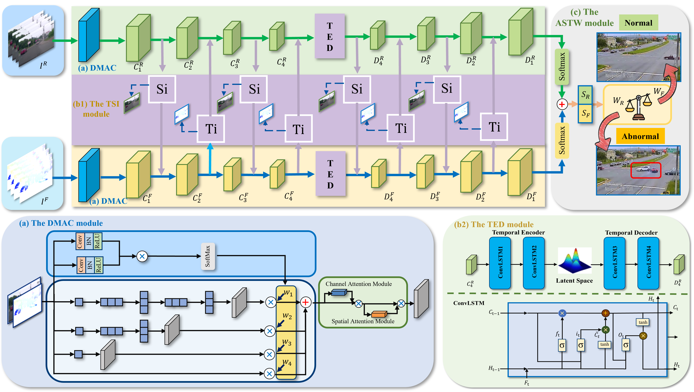

# MDTS-ADNet
## Offcial implementation of "Intelligent traffic accident detection system in complex dynamic scenarios based on the dual-stream spatiotemporal-fusion model".


## 1. Dependencies
```
python==3.6.13
torch==1.10.2+cu113
torchvision==0.11.3+cu113
torchaudio==0.10.2+cu113
torch-geometric==2.0.3
numpy==1.19.5
pandas==1.1.5
opencv==4.5.3
pillow==6.2.2
matplotlib==3.3.4
scikit-learn==0.24.2
scipy==1.5.3
tqdm==4.63.0
yacs==0.1.8
pyyaml==6.0.1
requests==2.27.1
protobuf==3.19.6
```
## 2. Usage
### 2.1 Data preparation
As the paper is under review, the dataset needs to be kept confidential for the time being, here we only disclose part of the dataset:
[4M-TAD_Part_1](https://drive.google.com/file/d/1piFA9N8RO185Uhq9kPaDcXAk3eUWXSoh/view?usp=sharing)

The full dataset will be updated after the acceptance of the article.

### 2.2 Train
The paper is under review and now needs to be kept confidential.
Code will be available soon.
### 2.3 Evaluation
The paper is under review and now needs to be kept confidential.
Code will be available soon.

## 3. Results
AUC is the core indicator.

|     Model      | 4M-TAD | AI City Challenge 2021 | 
| :------------: | :-------: | :---------: | 
|    MDTS-ADNet    |   84.33%   |    82.14%    | 

## Acknowledgment
The paper is under review and now needs to be kept confidential.

## Citation
The paper is under review and now needs to be kept confidential.
